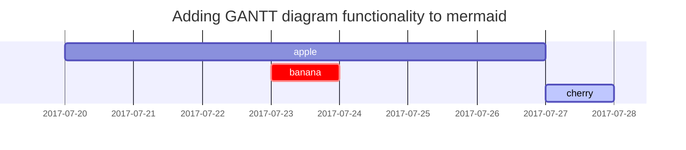

## 标题

<!-- markdownlint-capture -->
<!-- markdownlint-disable -->
# H1 — 标题
{: .mt-4 .mb-0 }

## H2 — 标题
{: data-toc-skip='' .mt-4 .mb-0 }

### H3 — 标题
{: data-toc-skip='' .mt-4 .mb-0 }

#### H4 — 标题
{: data-toc-skip='' .mt-4 }
<!-- markdownlint-restore -->

## 段落

Quisque egestas convallis ipsum, ut sollicitudin risus tincidunt a. Maecenas interdum malesuada egestas. Duis consectetur porta risus, sit amet vulputate urna facilisis ac. Phasellus semper dui non purus ultrices sodales. Aliquam ante lorem, ornare a feugiat ac, finibus nec mauris. Vivamus ut tristique nisi. Sed vel leo vulputate, efficitur risus non, posuere mi. Nullam tincidunt bibendum rutrum. Proin commodo ornare sapien. Vivamus interdum diam sed sapien blandit, sit amet aliquam risus mattis. Nullam arcu turpis, mollis quis laoreet at, placerat id nibh. Suspendisse venenatis eros eros.

## 列表

### 有序列表

1. 第一
2. 第二
3. 第三

### 无序列表

- 章节
  - 小节
    - 段落

### 待办列表

- [ ] 任务
  - [x] 步骤1
  - [x] 步骤2
  - [ ] 步骤3

### 描述列表

太阳
: 地球围绕运行的恒星

月亮
: 地球的天然卫星，通过反射太阳光可见

## 引用块

> 这行显示的是_引用块_。

## 提示框

<!-- markdownlint-capture -->
<!-- markdownlint-disable -->
> 显示`tip`类型提示框的示例。
{: .prompt-tip }

> 显示`info`类型提示框的示例。
{: .prompt-info }

> 显示`warning`类型提示框的示例。
{: .prompt-warning }

> 显示`danger`类型提示框的示例。
{: .prompt-danger }
<!-- markdownlint-restore -->

## 表格

| 公司名称                      | 联系人          | 国家 |
| :--------------------------- | :--------------- | ------: |
| Alfreds Futterkiste          | Maria Anders     | 德国 |
| Island Trading               | Helen Bennett    |      英国 |
| Magazzini Alimentari Riuniti | Giovanni Rovelli |   意大利 |

## 链接

<http://127.0.0.1:4000>

## 脚注

点击钩子将定位到脚注[^footnote]，这里是另一个脚注[^fn-nth-2]。

## 行内代码

这是`行内代码`的示例。

## 文件路径

这里是文件路径 `/path/to/the/file.extend`{: .filepath}。

## 代码块

### 普通代码块

```text
这是一个普通的代码片段，没有语法高亮和行号。
```

### 特定语言

```bash
if [ $? -ne 0 ]; then
  echo "The command was not successful.";
  #do the needful / exit
fi;
```

### 特定文件名

```sass
@import
  "colors/light-typography",
  "colors/dark-typography";
```
{: file='_sass/jekyll-theme-chirpy.scss'}

## 数学公式

数学公式由[**MathJax**](https://www.mathjax.org/)提供支持：

$$
\begin{equation}
  \sum_{n=1}^\infty 1/n^2 = \frac{\pi^2}{6}
  \label{eq:series}
\end{equation}
$$

我们可以引用这个公式 \eqref{eq:series}。

当 $a \ne 0$ 时，方程 $ax^2 + bx + c = 0$ 有两个解：

$$ x = {-b \pm \sqrt{b^2-4ac} \over 2a} $$

## Mermaid 图表



## 图片

### 默认（带标题）

{: width="972" height="589" }
_全屏宽度和居中对齐_

### 左对齐

{: width="972" height="589" .w-75 .normal}

### 左浮动

{: width="972" height="589" .w-50 .left}
Praesent maximus aliquam sapien. Sed vel neque in dolor pulvinar auctor. Maecenas pharetra, sem sit amet interdum posuere, tellus lacus eleifend magna, ac lobortis felis ipsum id sapien. Proin ornare rutrum metus, ac convallis diam volutpat sit amet. Phasellus volutpat, elit sit amet tincidunt mollis, felis mi scelerisque mauris, ut facilisis leo magna accumsan sapien. In rutrum vehicula nisl eget tempor. Nullam maximus ullamcorper libero non maximus. Integer ultricies velit id convallis varius. Praesent eu nisl eu urna finibus ultrices id nec ex. Mauris ac mattis quam. Fusce aliquam est nec sapien bibendum, vitae malesuada ligula condimentum.

### 右浮动

{: width="972" height="589" .w-50 .right}
Praesent maximus aliquam sapien. Sed vel neque in dolor pulvinar auctor. Maecenas pharetra, sem sit amet interdum posuere, tellus lacus eleifend magna, ac lobortis felis ipsum id sapien. Proin ornare rutrum metus, ac convallis diam volutpat sit amet. Phasellus volutpat, elit sit amet tincidunt mollis, felis mi scelerisque mauris, ut facilisis leo magna accumsan sapien. In rutrum vehicula nisl eget tempor. Nullam maximus ullamcorper libero non maximus. Integer ultricies velit id convallis varius. Praesent eu nisl eu urna finibus ultrices id nec ex. Mauris ac mattis quam. Fusce aliquam est nec sapien bibendum, vitae malesuada ligula condimentum.

### 深色/浅色模式和阴影

下面的图片将根据主题偏好切换深色/浅色模式，注意它带有阴影。

{: .light .w-75 .shadow .rounded-10 w='1212' h='668' }
{: .dark .w-75 .shadow .rounded-10 w='1212' h='668' }

## 视频



## 反向脚注

[^footnote]: 脚注来源
[^fn-nth-2]: 第二个脚注来源
